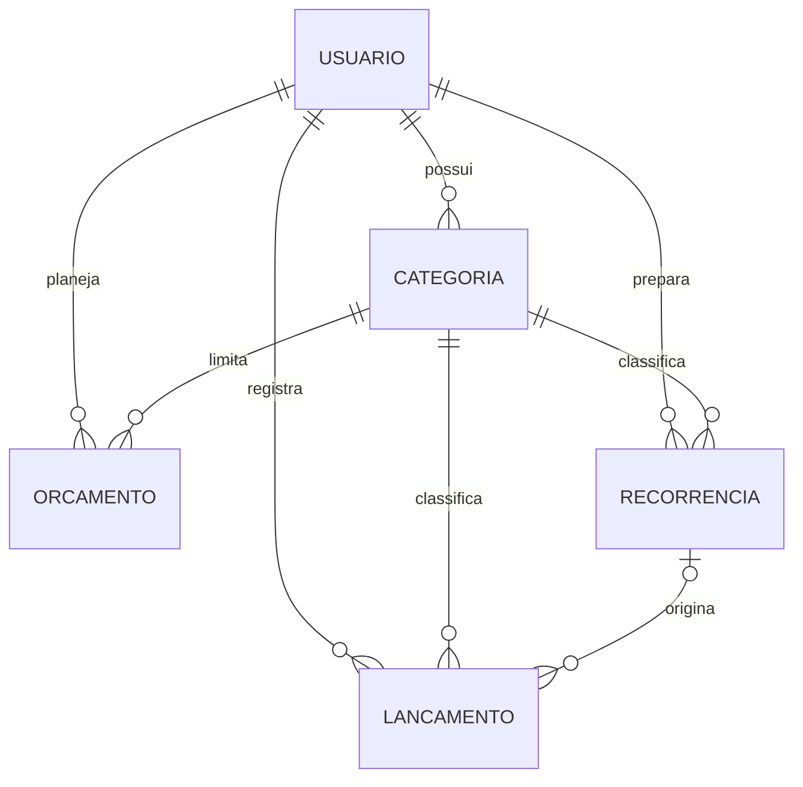

# Modelagem dos dados

**Versão:** 1.0 · **Data:** 27/09/2026 · **Referência:** ADR-01 e ADR-02.

Modelo da implementação final. O protótipo HTML usa representação simplificada em memória; não existe banco remoto ativo nesta entrega.

## Diagrama das entidades

Um usuário possui zero ou mais registros de cada entidade. Cada lançamento tem exatamente uma categoria e, opcionalmente, uma recorrência de origem. Uma recorrência pode gerar vários lançamentos, limitados a um por mês. São referências lógicas no Firestore e restrições locais no SQLite.

## Dicionário e invariantes

| Entidade | Campos | Regra principal |
|---|---|---|
| Usuário | `uid`, `nome`, `email`, `criadoEm` | UID do Firebase Auth. Senha não pertence ao banco de produto. |
| Categoria | `id`, `usuarioId`, `nome`, `tipo` | Categorias iniciais por usuário; receita ou despesa; sem edição nesta versão. |
| Lançamento | `id`, `usuarioId`, `categoriaId`, `tipo`, `valorCentavos`, `data`, `descricao`, `origem`, `recorrenciaId?`, `competenciaRecorrencia?`, controle | Valor positivo; data realizada; categoria compatível; origem manual, texto, foto ou recorrencia. |
| Orçamento | `id`, `usuarioId`, `categoriaId`, `mes`, `limiteCentavos`, controle | ID `categoriaId_mes`; categoria de despesa; único por usuário/categoria/mês. |
| Recorrência | `id`, `usuarioId`, `categoriaId`, `descricao`, `valorCentavos`, `diaDoMes`, `mesInicial`, `ativa`, controle | Despesa mensal; dia 1–31; confirmar mês não anterior ao inicial e data já ocorrida. |

**Controle:** `criadoEm`, `atualizadoEm`, `excluidoEm` opcional e `ultimaOperacaoId`. Instantes remotos definidos pelo servidor. Exclusões não entram em totais. SQLite também mantém `operacoes_pendentes`: `operacaoId`, `usuarioId`, `entidade`, `entidadeId`, `acao`, `payload`, `estado`.

## Estrutura remota

Sob `usuarios/{uid}`: `categorias/{id}`, `lancamentos/{id}`, `orcamentos/{categoriaId_AAAA-MM}` e `recorrencias/{id}`. A fila pendente é local e não se confunde com documentos financeiros remotos.

## Exemplo do registro ao orçamento

[exemplo-dados.json](exemplo-dados.json) contém somente dados fictícios: Alex, Alimentação, despesa de R$ 45,00 e limite de R$ 400,00; também Moradia, recorrência de internet de R$ 79,90 e sua ocorrência de setembro.

1. Alex escreve “gastei 45 no mercado ontem”. A sugestão ainda não é um lançamento persistido.
2. Ao confirmar, cria `lanc-mercado-01`, valor `4500`, categoria `alimentacao`, data `2026-09-24`.
3. Uma transação SQLite grava o lançamento e sua operação pendente. Sem rede, mostra o dado e a pendência.
4. Sincronizador grava o mesmo ID em `usuarios/demo-alex/lancamentos/lanc-mercado-01`. Reenvio não gera outro documento.
5. A consulta por categoria/mês soma R$ 45,00; limite de R$ 400,00 mostra R$ 355,00 disponíveis. Não existe saldo do orçamento armazenado separadamente.

## Da recorrência ao lançamento

`internet` prevê R$ 79,90 no dia 10, a partir de setembro. Modelo não reduz saldo. Confirmar setembro gera `internet_2026-09`, com `recorrenciaId: internet` e `competenciaRecorrencia: 2026-09`. Nova confirmação encontra a identidade e é recusada. Excluir a ocorrência mantém marcador para impedir recriação automática.

Dia 31 em mês menor vira seu último dia. Alterar o modelo não modifica lançamentos passados. Referência ao modelo excluído permanece explicável pelo marcador de exclusão.

## Isolamento entre usuários

Comparar UID do caminho com sessão validada. Escrita exige categoria do mesmo usuário e campos permitidos. Negar acesso fora do próprio caminho por padrão. Campo `usuarioId` enviado pelo cliente não substitui essa verificação.

Funções com SDK administrativo validam autorização por conta própria, pois não dependem das regras de cliente do Firestore. Testes previstos: caminho de outro usuário, `usuarioId` forjado, categoria alheia e chamada de IA sem sessão; todos devem falhar.

## Casos de conferência

| Caso | Resultado esperado |
|---|---|
| Mercado R$ 45,00 e internet R$ 79,90, sem receitas | Despesas R$ 124,90; saldo -R$ 124,90. |
| Editar mercado para R$ 50,00 | Alimentação R$ 50,00; sobra R$ 350,00. |
| Excluir mercado | Alimentação zero; orçamento preservado. |
| Confirmar internet novamente em setembro | Nenhum novo lançamento. |
| Outro usuário solicita os dados de Alex | Acesso negado. |

Resultados são expectativas calculadas do exemplo; não são testes de banco real já executados.
